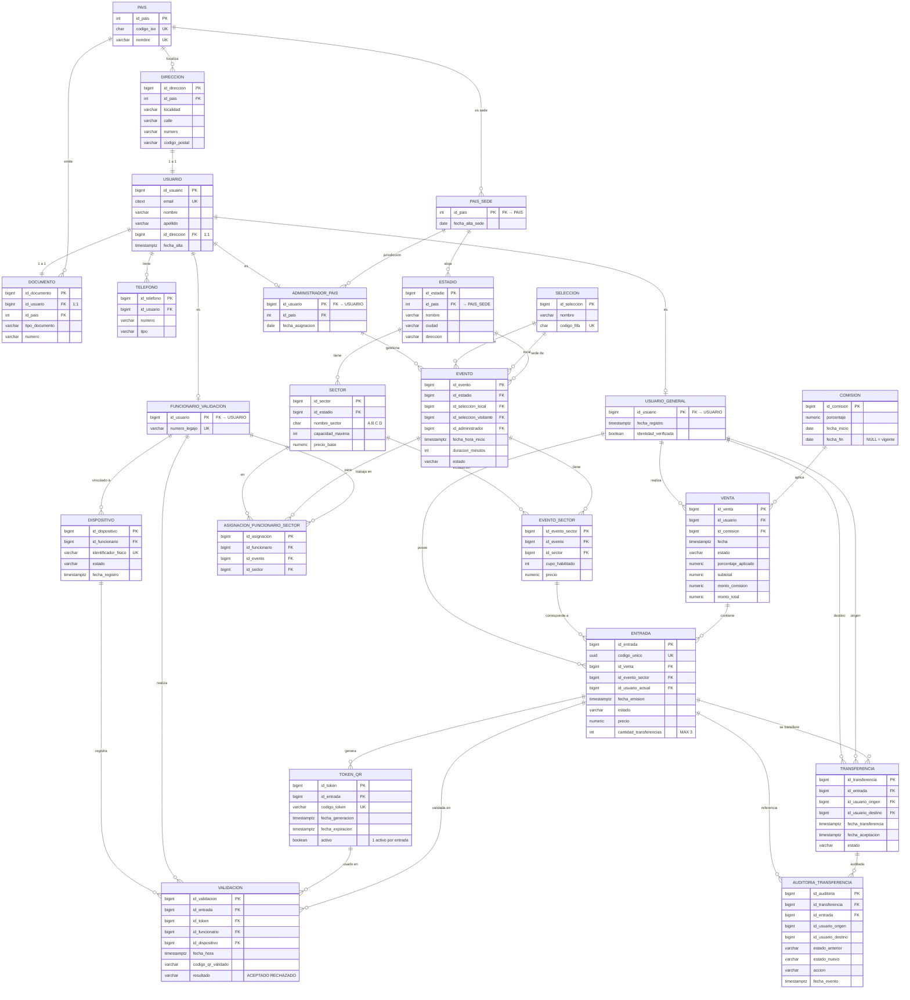

```mermaid
erDiagram

    PAIS {
        int id_pais PK
        char codigo_iso UK
        varchar nombre UK
    }

    PAIS_SEDE {
        int id_pais PK "FK → PAIS"
        date fecha_alta_sede
    }

    DIRECCION {
        bigint id_direccion PK
        int id_pais FK
        varchar localidad
        varchar calle
        varchar numero
        varchar codigo_postal
    }

    USUARIO {
        bigint id_usuario PK
        citext email UK
        varchar nombre
        varchar apellido
        bigint id_direccion FK "1:1"
        timestamptz fecha_alta
    }

    DOCUMENTO {
        bigint id_documento PK
        bigint id_usuario FK "1:1"
        int id_pais FK
        varchar tipo_documento
        varchar numero
    }

    TELEFONO {
        bigint id_telefono PK
        bigint id_usuario FK
        varchar numero
        varchar tipo
    }

    USUARIO_GENERAL {
        bigint id_usuario PK "FK → USUARIO"
        timestamptz fecha_registro
        boolean identidad_verificada
    }

    ADMINISTRADOR_PAIS {
        bigint id_usuario PK "FK → USUARIO"
        int id_pais FK
        date fecha_asignacion
    }

    FUNCIONARIO_VALIDACION {
        bigint id_usuario PK "FK → USUARIO"
        varchar numero_legajo UK
    }

    DISPOSITIVO {
        bigint id_dispositivo PK
        bigint id_funcionario FK
        varchar identificador_fisico UK
        varchar estado
        timestamptz fecha_registro
    }

    ESTADIO {
        bigint id_estadio PK
        int id_pais FK "→ PAIS_SEDE"
        varchar nombre
        varchar ciudad
        varchar direccion
    }

    SECTOR {
        bigint id_sector PK
        bigint id_estadio FK
        char nombre_sector "A B C D"
        int capacidad_maxima
        numeric precio_base
    }

    SELECCION {
        bigint id_seleccion PK
        varchar nombre
        char codigo_fifa UK
    }

    EVENTO {
        bigint id_evento PK
        bigint id_estadio FK
        bigint id_seleccion_local FK
        bigint id_seleccion_visitante FK
        bigint id_administrador FK
        timestamptz fecha_hora_inicio
        int duracion_minutos
        varchar estado
    }

    EVENTO_SECTOR {
        bigint id_evento_sector PK
        bigint id_evento FK
        bigint id_sector FK
        int cupo_habilitado
        numeric precio
    }

    ASIGNACION_FUNCIONARIO_SECTOR {
        bigint id_asignacion PK
        bigint id_funcionario FK
        bigint id_evento FK
        bigint id_sector FK
    }

    COMISION {
        bigint id_comision PK
        numeric porcentaje
        date fecha_inicio
        date fecha_fin "NULL = vigente"
    }

    VENTA {
        bigint id_venta PK
        bigint id_usuario FK
        bigint id_comision FK
        timestamptz fecha
        varchar estado
        numeric porcentaje_aplicado
        numeric subtotal
        numeric monto_comision
        numeric monto_total
    }

    ENTRADA {
        bigint id_entrada PK
        uuid codigo_unico UK
        bigint id_venta FK
        bigint id_evento_sector FK
        bigint id_usuario_actual FK
        timestamptz fecha_emision
        varchar estado
        numeric precio
        int cantidad_transferencias "MAX 3"
    }

    TRANSFERENCIA {
        bigint id_transferencia PK
        bigint id_entrada FK
        bigint id_usuario_origen FK
        bigint id_usuario_destino FK
        timestamptz fecha_transferencia
        timestamptz fecha_aceptacion
        varchar estado
    }

    TOKEN_QR {
        bigint id_token PK
        bigint id_entrada FK
        varchar codigo_token UK
        timestamptz fecha_generacion
        timestamptz fecha_expiracion
        boolean activo "1 activo por entrada"
    }

    VALIDACION {
        bigint id_validacion PK
        bigint id_entrada FK
        bigint id_token FK
        bigint id_funcionario FK
        bigint id_dispositivo FK
        timestamptz fecha_hora
        varchar codigo_qr_validado
        varchar resultado "ACEPTADO RECHAZADO"
    }

    AUDITORIA_TRANSFERENCIA {
        bigint id_auditoria PK
        bigint id_transferencia FK
        bigint id_entrada FK
        bigint id_usuario_origen
        bigint id_usuario_destino
        varchar estado_anterior
        varchar estado_nuevo
        varchar accion
        timestamptz fecha_evento
    }

    %% ─── RELACIONES ───────────────────────────────────────────

    PAIS           ||--o{ PAIS_SEDE                    : "es sede"
    PAIS           ||--o{ DIRECCION                    : "localiza"
    PAIS_SEDE      ||--o{ ESTADIO                      : "aloja"
    PAIS_SEDE      ||--o{ ADMINISTRADOR_PAIS           : "jurisdiccion"
    PAIS           ||--o{ DOCUMENTO                    : "emite"

    DIRECCION      ||--|| USUARIO                      : "1 a 1"
    USUARIO        ||--|| DOCUMENTO                    : "1 a 1"
    USUARIO        ||--o{ TELEFONO                     : "tiene"

    USUARIO        ||--o| USUARIO_GENERAL              : "es"
    USUARIO        ||--o| ADMINISTRADOR_PAIS           : "es"
    USUARIO        ||--o| FUNCIONARIO_VALIDACION       : "es"

    FUNCIONARIO_VALIDACION ||--o{ DISPOSITIVO          : "vinculado a"

    ESTADIO        ||--o{ SECTOR                       : "tiene"
    ESTADIO        ||--o{ EVENTO                       : "sede de"
    SELECCION      ||--o{ EVENTO                       : "local"
    SELECCION      ||--o{ EVENTO                       : "visitante"
    ADMINISTRADOR_PAIS ||--o{ EVENTO                   : "gestiona"

    EVENTO         ||--o{ EVENTO_SECTOR                : "tiene"
    SECTOR         ||--o{ EVENTO_SECTOR                : "incluido en"

    FUNCIONARIO_VALIDACION ||--o{ ASIGNACION_FUNCIONARIO_SECTOR : "trabaja en"
    EVENTO         ||--o{ ASIGNACION_FUNCIONARIO_SECTOR         : "para"
    SECTOR         ||--o{ ASIGNACION_FUNCIONARIO_SECTOR         : "en"

    COMISION       ||--o{ VENTA                        : "aplica"
    USUARIO_GENERAL ||--o{ VENTA                       : "realiza"

    VENTA          ||--o{ ENTRADA                      : "contiene"
    EVENTO_SECTOR  ||--o{ ENTRADA                      : "corresponde a"
    USUARIO_GENERAL ||--o{ ENTRADA                     : "posee"

    ENTRADA        ||--o{ TRANSFERENCIA                : "se transfiere"
    USUARIO_GENERAL ||--o{ TRANSFERENCIA               : "origen"
    USUARIO_GENERAL ||--o{ TRANSFERENCIA               : "destino"

    ENTRADA        ||--o{ TOKEN_QR                     : "genera"

    ENTRADA        ||--o{ VALIDACION                   : "validada en"
    TOKEN_QR       ||--o{ VALIDACION                   : "usado en"
    FUNCIONARIO_VALIDACION ||--o{ VALIDACION           : "realiza"
    DISPOSITIVO    ||--o{ VALIDACION                   : "registra"

    TRANSFERENCIA  ||--o{ AUDITORIA_TRANSFERENCIA      : "auditada"
    ENTRADA        ||--o{ AUDITORIA_TRANSFERENCIA      : "referencia"
```
